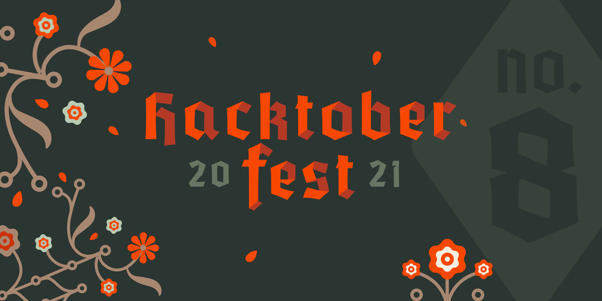

# Hactoberfest '21 - Little Steps

<p align="center">
    
    
    
</p>



## Table of Contents

====================

- [About Hacktoberfest &#39;21](#about-hacktoberfest-21)
- [Hackbar](#hackbar)
- [How to create a hackbar](#how-to-create-a-hackbar)
  - [For Beginners](#for-beginners)
  - [For Intermediates](#for-intermediates)
- [How to create a Pull Request](#how-to-create-a-pull-request-pr)
- [Hacktoberfest &#39;21 Guideline](#hacktoberfest-21-guideline)
- [License](#license)

> Slack Channel 👉 [Slack](https://join.slack.com/t/hacktoberfest-x668034/shared_invite/zt-w6jfr6vr-K8uvU~mdWkHzD6bAy9vk9Q)

## About Hacktoberfest '21

Hosted by DigitalOcean for the 8th year in a row, Hacktoberfest encourages participation in giving back to the open-source community by completing PR, participating in events, and donating to open-source projects.

## Hackbar

## How to create a Hackbar (Beginners)

> written with `markdown`

### Steps

1. Go to the directory `/md-posts/`
2. Create a folder `<YOUR_USERNAME>.md`
3. Edit the file as the following template

```markdown
---
username: <YOUR_USERNAME>
title: <TITLE>
date: <MONTH DATE, YEAR>
cover_img: '/assets/md-images/<YOUR_IMAGE>'
excerpt: <EXCERPT>
---

# <TITLE>

<CONTENT>
```

## For Intermediates

> Written with  `TypeScript`

### Steps

1. Go to the directory `/pages/jx-posts/`
2. Create a file `<YOUR_USERNAME>.tsx`
3. Edit the file [in Next.js style]
    - don't use `<Image />`, instead use ``
    - [preferred] use `tailwindCSS`
4. Add the following snippets in bottom of the file.
```typescript
export const postConfig = {
    username: <YOUR_USERNAME>,
    title: <TITLE>,
    date: <MONTH DATE, YEAR>,
    cover_img: '/assets/jx-images/<YOUR_IMAGE>',
    excerpt: <EXCERPT>
}
```

## How to create a Pull Request (PR)

To know about the process of PR creating check the post 👉 [Git &amp; GitHub — Open a Pull Request [As fast as possible]](https://tasnimzotder.com/blog/git-and-github-pull-request-as-fast-as-possible)

## Project Structure (Important Ones)

- assets (assets for the repository)
- pages
  - jx-posts (posts written in `.jsx`/`.tsx`)
- md-posts (posts written in `.md`)
- public (public directory)
  - assets
    - md-images (images for posts in `.md`)
    - jx-images (images for posts in `.jsx`/`.tsx`)
    - other
- styles
  - jx-styles (style sheets for posts in `jsx`/`tsx`)

## Tech Stacks

### Frontend

- Next.js
- TailwindCSS
- TypeScript
- Sass

### Publishing

- GitHub Pages

## Hacktoberfest '21 Guideline

### Rules

- ✅ PR can be submitted to any opted-in repository on GitHub or GitLab.
- ✅ The PR must contain commit you made yourself.
- ❎ If a maintainer reports your PR as spam, it will not be counted towards your participation in Hacktoberfest.
- ❎ If a maintainer reports behavior that's not in line with the project's `code of conduct`, you will be ineligible to participate.
- ✅ To get a shirt, you must make four approved PR(s) on opted-in projects between October 1-31 in any time zone.

## Maintainers

| Tasnim Zotder                                                                      | Rokibul Islam                                                                       |
| ---------------------------------------------------------------------------------- | ----------------------------------------------------------------------------------- |
| <kbd></kbd> | <kbd></kbd> |
| [tasnimzotder](https://github.com/tasnimzotder)                                    | [rokibulislaam](https://github.com/rokibulislaam)                                   |
| [tasnimzotder.com](https://tasnimzotder.com)                                       |                                                                                     |

## License

This project is licensed under the [MIT License](LICENSE).
