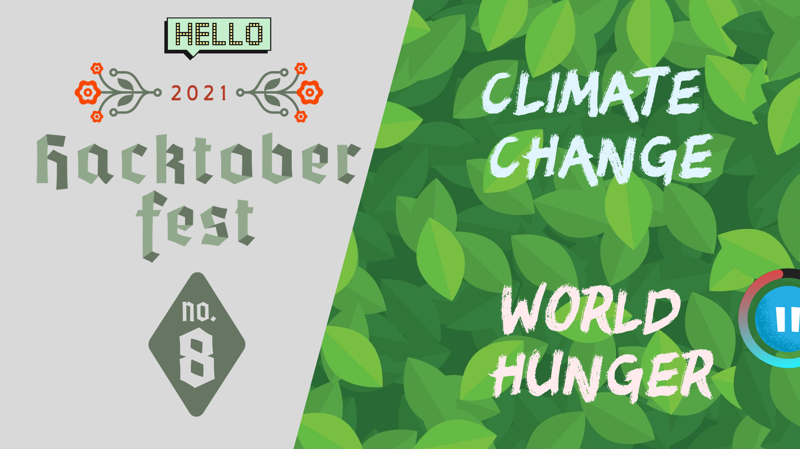

# Hactoberfest '21 - Little Steps

<p align="center">
    
    
</p>




## Theme: Climate Change & World Hunger

The purpose of this repository is to help the users (developers) with Git, GitHub and Open-Source. Besides, this repository is designed around Climate-Change. Each post contains some messages on climate-change and some steps towards a better tomorrow. 

2021 is going to a bad year for world hunger. According to UN World Food Programme, nearly 957 million people across 93 countries don't have enough to eat.
## > Join Discord Server 👉 [Discord](https://discord.gg/f4sYVwS8C6)

### Learn more 👉 [Hacktoberfest](https://hacktoberfest.digitalocean.com/)
### Register here 👉 [Hacktoberfest Registration](https://hacktoberfest.digitalocean.com/register)

## Table of Contents 📑

====================

- [About Hacktoberfest &#39;21](#about-hacktoberfest-21)
- [Hackbar](#hackbar-🍫)
- [How to create a hackbar - Beginners](#how-to-create-a-hackbar-beginners)
- [How to create a Hackbar (Intermediates) 🏗️](#how-to-create-a-hackbar-intermediates-🏗️)
- [How to create a Pull Request - Using web editor](#how-to-create-a-pull-request-using-web-editor)
- [How to create a Pull Request - Using local machine 💻](#how-to-create-a-pull-request-using-local-machine-💻)
- [Hacktoberfest &#39;21 Guideline](#hacktoberfest-21-guideline)
- [Maintainers](#maintainers)
- [License](#license)

## About Hacktoberfest '21

Hosted by DigitalOcean for the 8th year in a row, Hacktoberfest encourages participation in giving back to the open-source community by completing PR, participating in events, and donating to open-source projects.

## Hackbar 🍫

The posts in this repository is referred as `Hackbar`s. This word came from two words - Hacktoberfest and Chocolate Bar.

## How to create a Hackbar (Beginners)

> written with `markdown`

### Steps

1. Go to the directory `/md-posts/`
2. Create a file `<YOUR_USERNAME>.md`
3. Edit the file as the following template

```markdown
---
username: <YOUR_USERNAME>
title: <TITLE>
date: <MONTH DATE, YEAR>
cover_img: '<YOUR_IMAGE_URL>'
excerpt: <EXCERPT>
---

# <TITLE>

<CONTENT>
```

- for local images, in case of `<YOUR_IMAGE_URL>` you can use `/assets/md-images/<YOUR_IMAGE>` in `<YOUR_USERNAME>.md` file.

- the local images should be in `public/assets/md-images/` directory.

## How to create a Hackbar (Intermediates) 🏗️

> Written with `TypeScript`

🚧 UNDER CONSTRUCTION 🚧

## How to create a Pull Request - using web editor

To know about the process of PR creating check the post 👉 [Git &amp; GitHub — Open a Pull Request [As fast as possible]](https://tasnimzotder.com/blog/git-and-github-pull-request-as-fast-as-possible)

### 1. Fork the repository

From the top-right corner of this repository, click on `Fork` to fork this repository to your account.

### 2. Go to the forked repository in your account

### 3. Open in the web editor

Focusing on your browser tab, click `.` (dot) from your keyboard. This will open your repository in a web editor.

### 4. Edit the repository

Now, edit the repository or add contents according to the guideline. Make sure that the contents are authentic.

### 5. Add and commit the changes

In the web editor type `ctrl + shift + G`; this will open the Source Control. There, type your commit message on `MESSAGE` section and commit by clicking the `✔️` symbol above.

### 6. Create a pull request

From the Control Panel, click on the menu (`...`) and select `Pull Request > Create Pull Request`


## How to create a Pull Request - Using local machine 💻

### 1. Fork the repository

From the top-right corner of this repository, click on `Fork` to fork this repository to your account.
### 2. Copy the repository URL 

```markdown
https://github.com/<YOUR_USERNAME>/hacktoberfest-2021-little-steps.git
```

### 3. Paste the following code in the terminal - (change <YOUR_USERNAME> with your username)

```bash
git bash https://github.com/<YOUR_USERNAME>/hacktoberfest-2021-little-steps.git
```

### 4. Go to the project directory & open it in VS Code

```bash
cd hacktoberfest-2021-little-steps
code .
```

this will open the repository in a VS Code window.

### 5. Create a new branch

```bash
git checkout -b2 <BRANCH_NAME>
```

### 6. Edit the repository

Now, edit the repository or add contents according to the guideline. Make sure that the contents are authentic.

### 7. Add and commit the changes

```bash
git add .
git commit -m "<COMMIT_MESSAGE>"
```

### 8. Push the commit(s)

```bash
git push origin -u <BRANCH_NAME>
```

### 9. Open a pull request

Go to your repository on the web and go to your branch. Click on the `Contribute` from the top-right, and then click `Open pull request` to open a pull request.


## Project Structure (Important Ones)

- assets (assets for the repository)
- pages
  - jx-posts (posts written in `.jsx`/`.tsx`)
- md-posts (posts written in `.md`)
- lib
- public (public directory)
  - assets
    - md-images (images for posts in `.md`)
    - jx-images (images for posts in `.jsx`/`.tsx`)
    - other
- styles
  - jx-styles (style sheets for posts in `jsx`/`tsx`)

## Tech Stacks

### Frontend

- Next.js
- TailwindCSS
- TypeScript
- Sass

### Publishing

- GitHub Pages
- Vercel

## Hacktoberfest '21 Guideline

### Rules

- ✅ PR can be submitted to any opted-in repository on GitHub or GitLab.
- ✅ The PR must contain commit you made yourself.
- ❎ If a maintainer reports your PR as spam, it will not be counted towards your participation in Hacktoberfest.
- ❎ If a maintainer reports behavior that's not in line with the project's `code of conduct`, you will be ineligible to participate.
- ✅ To get a shirt, you must make four approved PR(s) on opted-in projects between October 1-31 in any time zone.

## Maintainers

| Tasnim Zotder                                                                      | Rokibul Islam                                                                       |
| ---------------------------------------------------------------------------------- | ----------------------------------------------------------------------------------- |
| <kbd></kbd> | <kbd></kbd> |
| [tasnimzotder](https://github.com/tasnimzotder)                                    | [rokibulislaam](https://github.com/rokibulislaam)                                   |
| [tasnimzotder.com](https://tasnimzotder.com)                                       |                                                                                     |

## License

This project is licensed under the [MIT License](LICENSE).
